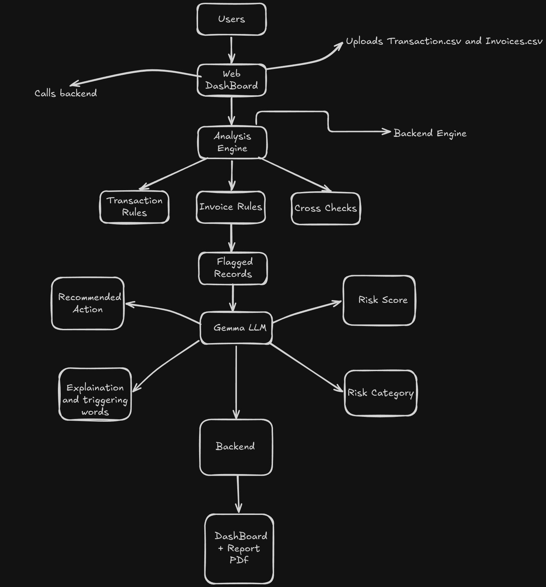

# SentinelAI

**AI-powered compliance investigator for financial risk detection.**

SentinelAI ingests transaction and invoice CSV data, runs it through a set of deterministic fraud-detection rules, cross-checks the two datasets against each other, and hands every flagged record to an LLM (Gemma, via the Gemini API) to produce a human-readable risk explanation and a recommended action — all wrapped in a clean web dashboard and exportable PDF report.

---

# Architecture Diagram 

<p align="center">
  
</p>

```
Transaction CSV ──┐
                   ├──►  Rule Engine  ──►  Cross-Check  ──►  Gemma Analysis  ──►  Flagged Records  ──►  Dashboard / PDF Report
Invoice CSV ───────┘
```

1. **Upload** — Transaction and invoice CSVs are uploaded via the web UI.
2. **Rule Engine** — Each record is run through deterministic rules (see below) to catch known fraud patterns.
3. **Cross-Check** — Linked transactions and invoices are compared for mismatches.
4. **AI Analysis** — Every flagged record is sent to Gemma for a `risk_score`, `risk_category`, plain-English `explanation`, and `recommended_action`. If no API key is configured, a deterministic fallback keeps the pipeline fully functional offline.
5. **Reporting** — Results are viewable on an interactive dashboard and exportable as a formatted PDF compliance report.

---

## Detection Rules

**Transactions** (`backend/rules/transaction_rules.py`)
| Rule | Trigger |
|---|---|
| Structuring | Amount just under the reporting threshold (₹9,900–₹10,000) |
| High Value + New Account | Amount ≥ ₹25,000 from an account < 30 days old |
| Round Amount | Amount is an exact multiple of ₹1,000 |
| Odd Hours | Transaction timestamped between 12 AM–5 AM |
| Velocity | 5+ transactions from the same sender within a 10-minute window |

**Invoices** (`backend/rules/invoice_rules.py`)
| Rule | Trigger |
|---|---|
| Duplicate Invoice | Same vendor + amount appears more than once |
| Invalid GST | GST number is not exactly 15 characters |
| Blacklisted Vendor | Vendor matches a known blacklist |
| Future Date | Invoice dated after today |

**Cross-Check** (`backend/rules/cross_check.py`)
| Rule | Trigger |
|---|---|
| Amount Mismatch | Linked transaction and invoice amounts don't match |

---

## Tech Stack

| Layer | Technology |
|---|---|
| Backend | Python, FastAPI, Pydantic, Pandas, ReportLab |
| AI | Google Gemini / Gemma (`google-genai`) |
| Frontend | HTML, CSS, vanilla JavaScript (Lucide icons) |
| Storage | In-memory store (no database required) |

---

## Project Structure

```
SentinalAi/
├── backend/
│   ├── main.py                  # FastAPI app + route registration
│   ├── routes/
│   │   ├── upload.py            # POST /upload — accepts CSVs, runs the pipeline
│   │   └── flagged.py           # GET /flagged-records — returns flagged results
│   ├── services/
│   │   ├── csv_service.py       # CSV parsing & validation
│   │   ├── analysis_engine.py   # Orchestrates rules + cross-check + AI analysis
│   │   ├── gemma_service.py     # Gemini/Gemma API integration + fallback logic
│   │   └── report_service.py    # PDF compliance report generation
│   ├── rules/                   # Deterministic fraud-detection rules
│   ├── models/                  # Pydantic models (Transaction, Invoice)
│   ├── schemas/                 # Request/response schemas
│   ├── storage/                 # In-memory result store
│   ├── prompts/                 # System & report prompts for the LLM
│   ├── data/                    # Sample transaction/invoice CSVs
│   └── requirements.txt
└── frontend/
    ├── upload.html              # Upload portal
    ├── dashboard.html           # Investigation dashboard
    ├── report.html              # Compliance report view
    └── js/                      # Frontend logic (config, upload, dashboard, report)
```

---

## Getting Started

### Prerequisites
- Python 3.10+
- A modern browser (frontend is static HTML/JS — no build step needed)

### 1. Clone the repository
```bash
git clone https://github.com/arihanthsharma15/SentinalAi.git
cd SentinalAi
```

### 2. Set up the backend
```bash
cd backend
pip install -r requirements.txt
```

### 3. Configure environment variables
```bash
cp .env.example .env
```

| Variable | Description | Default |
|---|---|---|
| `GEMMA_API_KEY` | Your Gemini/Gemma API key | — |
| `GEMMA_ENABLED` | Set `true` to enable live AI calls | `false` |
| `MODEL_NAME` | Model to use for analysis | `gemma-3n-e4b-it` |
| `BACKEND_PORT` | Backend server port | `8000` |
| `FRONTEND_PORT` | Frontend server port | `3000` |

> **Note:** If `GEMMA_ENABLED` is `false` or no key is provided, SentinelAI automatically falls back to a deterministic rule-based explanation engine — the full workflow (upload → flag → report) still works end-to-end without any API key.

### 4. Run the backend
```bash
uvicorn main:app --reload --port 8000
```
The API will be live at `http://127.0.0.1:8000`.

### 5. Serve the frontend
From the `frontend/` directory, serve the static files with any local server, e.g.:
```bash
cd frontend
python -m http.server 3000
```
Then open `http://127.0.0.1:3000/upload.html` in your browser.

> Make sure `API_BASE_URL` in `frontend/js/config.js` matches your running backend address.

---

## API Reference

| Method | Endpoint | Description |
|---|---|---|
| `GET` | `/` | Health check / welcome message |
| `GET` | `/health` | Service health status |
| `POST` | `/upload` | Upload `transaction_csv` + `invoice_csv`, runs the full analysis pipeline |
| `GET` | `/flagged-records` | Returns all flagged records from the latest analysis |

**Sample `/upload` response:**
```json
{
  "message": "Analysis completed",
  "total_transactions": 250,
  "flagged_count": 18
}
```

**Sample flagged record (`FlaggedRecord`):**
```json
{
  "id": "TXN-1042",
  "type": "Transaction",
  "sender": "John Doe",
  "receiver": "Jane Smith",
  "amount": 24999.0,
  "rules_triggered": ["High Value + New Account", "Round Amount"],
  "gemmaAnalysis": {
    "risk_score": 82,
    "risk_category": "high",
    "explanation": "This transaction is flagged because...",
    "recommended_action": "escalate_to_compliance"
  }
}
```

---

## CSV Format

**`transactions.csv`** requires: `transaction_id, sender_name, sender_account_age_days, receiver_name, receiver_account_age_days, amount, timestamp, transaction_type, location, description, linked_invoice_id`

**`invoices.csv`** requires: `invoice_id, vendor_name, gst_number, amount, invoice_date, payment_status, linked_transaction_id`

Sample datasets are provided in `backend/data/`.

---

